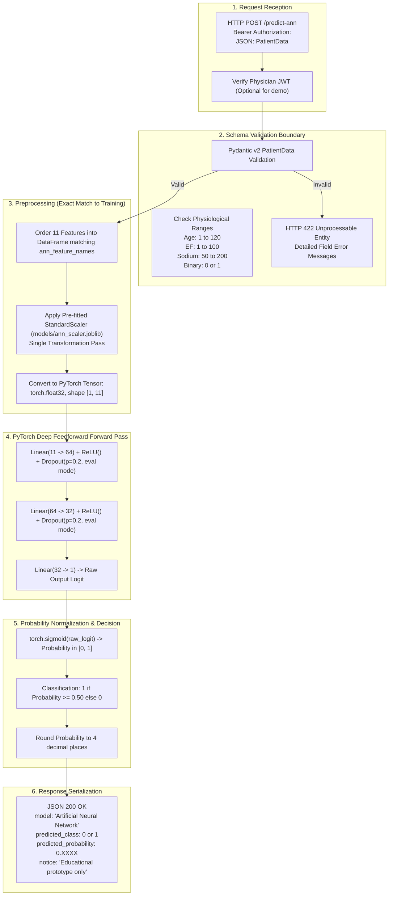

# Artificial Neural Network Inference Pipeline

```mermaid
flowchart TD
    subgraph RequestIngestion["1. Request Reception"]
        ClientReq["HTTP POST /predict-ann\nBearer Authorization: <token>\nJSON: PatientData"]
        AuthCheck["Verify Physician JWT (Optional for demo)"]
    end

    subgraph ValidationBoundary["2. Schema Validation Boundary"]
        PydanticSchema["Pydantic v2 PatientData Validation"]
        BoundCheck["Check Physiological Ranges\nAge: 1 to 120\nEF: 1 to 100\nSodium: 50 to 200\nBinary: 0 or 1"]
        Reject422["HTTP 422 Unprocessable Entity\nDetailed Field Error Messages"]
    end

    subgraph PreprocessingStep["3. Preprocessing (Exact Match to Training)"]
        DataFrameOrder["Order 11 Features into DataFrame matching ann_feature_names"]
        ApplyScaler["Apply Pre-fitted StandardScaler (models/ann_scaler.joblib)\nSingle Transformation Pass"]
        ToTensor["Convert to PyTorch Tensor: torch.float32, shape [1, 11]"]
    end

    subgraph NetworkForwardPass["4. PyTorch Deep Feedforward Forward Pass"]
        Layer1["Linear(11 -> 64) + ReLU() + Dropout(p=0.2, eval mode)"]
        Layer2["Linear(64 -> 32) + ReLU() + Dropout(p=0.2, eval mode)"]
        Layer3["Linear(32 -> 1) -> Raw Output Logit"]
    end

    subgraph NormalizationAndDecision["5. Probability Normalization & Decision"]
        SigmoidNorm["torch.sigmoid(raw_logit) -> Probability in [0, 1]"]
        Thresholding["Classification: 1 if Probability >= 0.50 else 0"]
        RoundDec["Round Probability to 4 decimal places"]
    end

    subgraph ResponseDispatch["6. Response Serialization"]
        JSONResp["JSON 200 OK\nmodel: 'Artificial Neural Network'\npredicted_class: 0 or 1\npredicted_probability: 0.XXXX\nnotice: 'Educational prototype only'"]
    end

    ClientReq --> AuthCheck --> PydanticSchema
    PydanticSchema -->|Invalid| Reject422
    PydanticSchema -->|Valid| DataFrameOrder
    DataFrameOrder --> ApplyScaler --> ToTensor
    ToTensor --> Layer1 --> Layer2 --> Layer3
    Layer3 --> SigmoidNorm --> Thresholding --> RoundDec --> JSONResp
```
