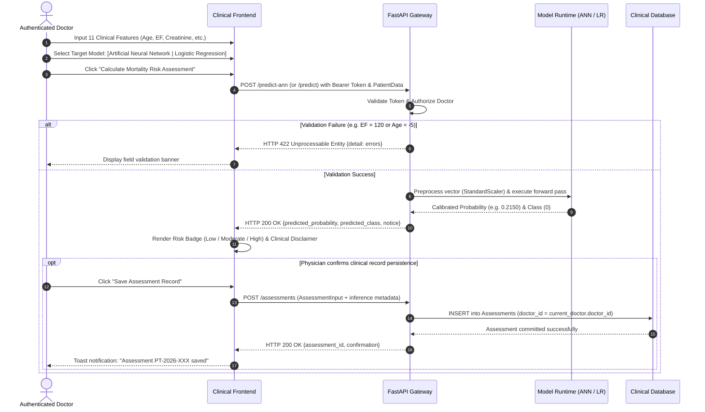

# Patient Clinical Assessment & Prediction Workflow

```mermaid
sequenceDiagram
    autonumber
    actor Physician as Authenticated Doctor
    participant UI as Clinical Frontend
    participant Backend as FastAPI Gateway
    participant Predictor as Model Runtime (ANN / LR)
    participant DB as Clinical Database

    Physician->>UI: Input 11 Clinical Features (Age, EF, Creatinine, etc.)
    Physician->>UI: Select Target Model: [Artificial Neural Network | Logistic Regression]
    Physician->>UI: Click "Calculate Mortality Risk Assessment"

    UI->>Backend: POST /predict-ann (or /predict) with Bearer Token & PatientData
    Backend->>Backend: Validate Token & Authorize Doctor

    alt Validation Failure (e.g. EF = 120 or Age = -5)
        Backend-->>UI: HTTP 422 Unprocessable Entity {detail: errors}
        UI-->>Physician: Display field validation banner
    else Validation Success
        Backend->>Predictor: Preprocess vector (StandardScaler) & execute forward pass
        Predictor-->>Backend: Calibrated Probability (e.g. 0.2150) & Class (0)
        
        Backend-->>UI: HTTP 200 OK {predicted_probability, predicted_class, notice}
        UI->>UI: Render Risk Badge (Low / Moderate / High) & Clinical Disclaimer

        opt Physician confirms clinical record persistence
            Physician->>UI: Click "Save Assessment Record"
            UI->>Backend: POST /assessments (AssessmentInput + inference metadata)
            Backend->>DB: INSERT into Assessments (doctor_id = current_doctor.doctor_id)
            DB-->>Backend: Assessment committed successfully
            Backend-->>UI: HTTP 200 OK {assessment_id, confirmation}
            UI-->>Physician: Toast notification: "Assessment PT-2026-XXX saved"
        end
    end
```
