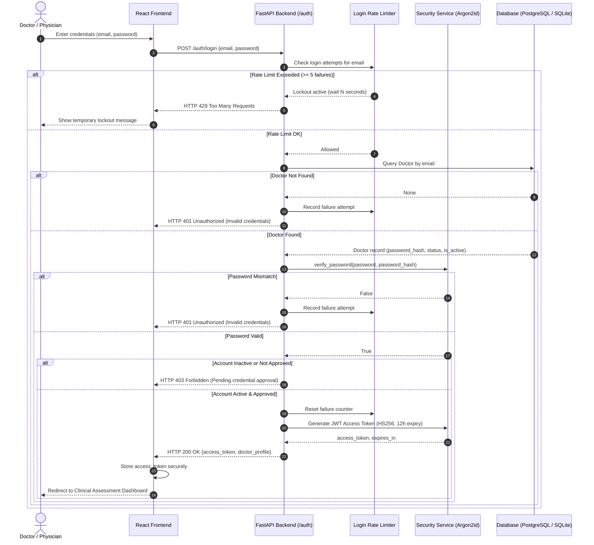

# Physician Authentication & Security Flow

```mermaid
sequenceDiagram
    autonumber
    actor Physician as Doctor / Physician
    participant UI as React Frontend
    participant API as FastAPI Backend (/auth)
    participant RateLimiter as Login Rate Limiter
    participant Security as Security Service (Argon2id)
    participant DB as Database (PostgreSQL / SQLite)

    Physician->>UI: Enter credentials (email, password)
    UI->>API: POST /auth/login {email, password}
    
    API->>RateLimiter: Check login attempts for email
    alt Rate Limit Exceeded (>= 5 failures)
        RateLimiter-->>API: Lockout active (wait N seconds)
        API-->>UI: HTTP 429 Too Many Requests
        UI-->>Physician: Show temporary lockout message
    else Rate Limit OK
        RateLimiter-->>API: Allowed
        API->>DB: Query Doctor by email
        alt Doctor Not Found
            DB-->>API: None
            API->>RateLimiter: Record failure attempt
            API-->>UI: HTTP 401 Unauthorized (Invalid credentials)
        else Doctor Found
            DB-->>API: Doctor record (password_hash, status, is_active)
            API->>Security: verify_password(password, password_hash)
            alt Password Mismatch
                Security-->>API: False
                API->>RateLimiter: Record failure attempt
                API-->>UI: HTTP 401 Unauthorized (Invalid credentials)
            else Password Valid
                Security-->>API: True
                alt Account Inactive or Not Approved
                    API-->>UI: HTTP 403 Forbidden (Pending credential approval)
                else Account Active & Approved
                    API->>RateLimiter: Reset failure counter
                    API->>Security: Generate JWT Access Token (HS256, 12h expiry)
                    Security-->>API: access_token, expires_in
                    API-->>UI: HTTP 200 OK {access_token, doctor_profile}
                    UI->>UI: Store access_token securely
                    UI-->>Physician: Redirect to Clinical Assessment Dashboard
                end
            end
        end
    end
```
