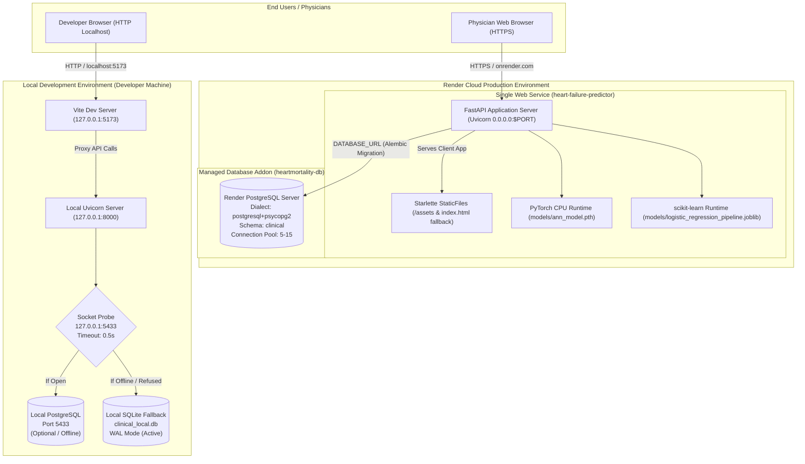

# Deployment Architecture Diagram

```mermaid
flowchart TD
    subgraph RenderCloud["Render Cloud Production Environment"]
        subgraph WebService["Single Web Service (heart-failure-predictor)"]
            FastAPIServer["FastAPI Application Server (Uvicorn 0.0.0.0:$PORT)"]
            StaticMount["Starlette StaticFiles (/assets & index.html fallback)"]
            PyTorchRuntime["PyTorch CPU Runtime (models/ann_model.pth)"]
            ScikitRuntime["scikit-learn Runtime (models/logistic_regression_pipeline.joblib)"]
        end

        subgraph ManagedPostgreSQL["Managed Database Addon (heartmortality-db)"]
            CloudPG[("Render PostgreSQL Server\nDialect: postgresql+psycopg2\nSchema: clinical\nConnection Pool: 5-15")]
        end

        FastAPIServer -->|Serves Client App| StaticMount
        FastAPIServer --> PyTorchRuntime
        FastAPIServer --> ScikitRuntime
        FastAPIServer -->|"DATABASE_URL (Alembic Migration)"| CloudPG
    end

    subgraph LocalEnvironment["Local Development Environment (Developer Machine)"]
        LocalFastAPI["Local Uvicorn Server (127.0.0.1:8000)"]
        ViteDev["Vite Dev Server (127.0.0.1:5173)"]
        LocalProbe{"Socket Probe\n127.0.0.1:5433\nTimeout: 0.5s"}
        LocalPG[("Local PostgreSQL\nPort 5433\n(Optional / Offline)")]
        LocalSQLite[("Local SQLite Fallback\nclinical_local.db\nWAL Mode (Active)")]

        ViteDev -->|Proxy API Calls| LocalFastAPI
        LocalFastAPI --> LocalProbe
        LocalProbe -->|If Open| LocalPG
        LocalProbe -->|If Offline / Refused| LocalSQLite
    end

    subgraph Clients["End Users / Physicians"]
        BrowserProd["Physician Web Browser (HTTPS)"]
        BrowserDev["Developer Browser (HTTP Localhost)"]
    end

    BrowserProd -->|"HTTPS / onrender.com"| FastAPIServer
    BrowserDev -->|"HTTP / localhost:5173"| ViteDev
```
