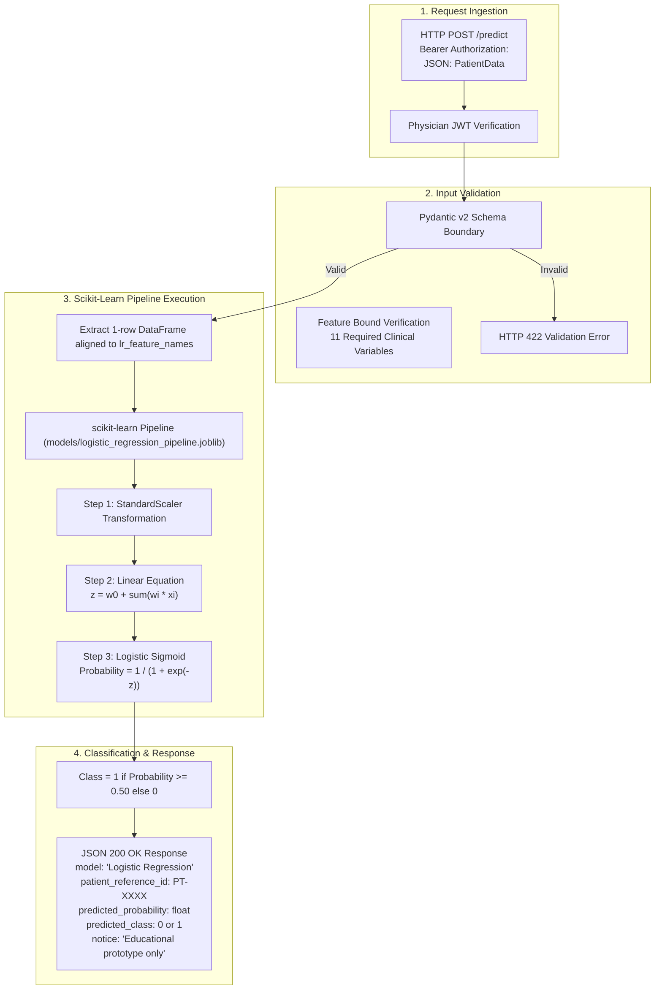

# Logistic Regression Inference Pipeline

```mermaid
flowchart TD
    subgraph RequestIngestion["1. Request Ingestion"]
        ClientReq["HTTP POST /predict\nBearer Authorization: <token>\nJSON: PatientData"]
        AuthCheck["Physician JWT Verification"]
    end

    subgraph SchemaVerification["2. Input Validation"]
        PydanticValidation["Pydantic v2 Schema Boundary"]
        CheckBounds["Feature Bound Verification\n11 Required Clinical Variables"]
        Error422["HTTP 422 Validation Error"]
    end

    subgraph PipelineInference["3. Scikit-Learn Pipeline Execution"]
        ExtractFrame["Extract 1-row DataFrame aligned to lr_feature_names"]
        LoadedPipeline["scikit-learn Pipeline (models/logistic_regression_pipeline.joblib)"]
        Standardize["Step 1: StandardScaler Transformation"]
        LinearModel["Step 2: Linear Equation\nz = w0 + sum(wi * xi)"]
        LogitFunction["Step 3: Logistic Sigmoid\nProbability = 1 / (1 + exp(-z))"]
    end

    subgraph OutputFormatting["4. Classification & Response"]
        ClassDecision["Class = 1 if Probability >= 0.50 else 0"]
        FormatJSON["JSON 200 OK Response\nmodel: 'Logistic Regression'\npatient_reference_id: PT-XXXX\npredicted_probability: float\npredicted_class: 0 or 1\nnotice: 'Educational prototype only'"]
    end

    ClientReq --> AuthCheck --> PydanticValidation
    PydanticValidation -->|Invalid| Error422
    PydanticValidation -->|Valid| ExtractFrame
    ExtractFrame --> LoadedPipeline
    LoadedPipeline --> Standardize --> LinearModel --> LogitFunction
    LogitFunction --> ClassDecision --> FormatJSON
```
