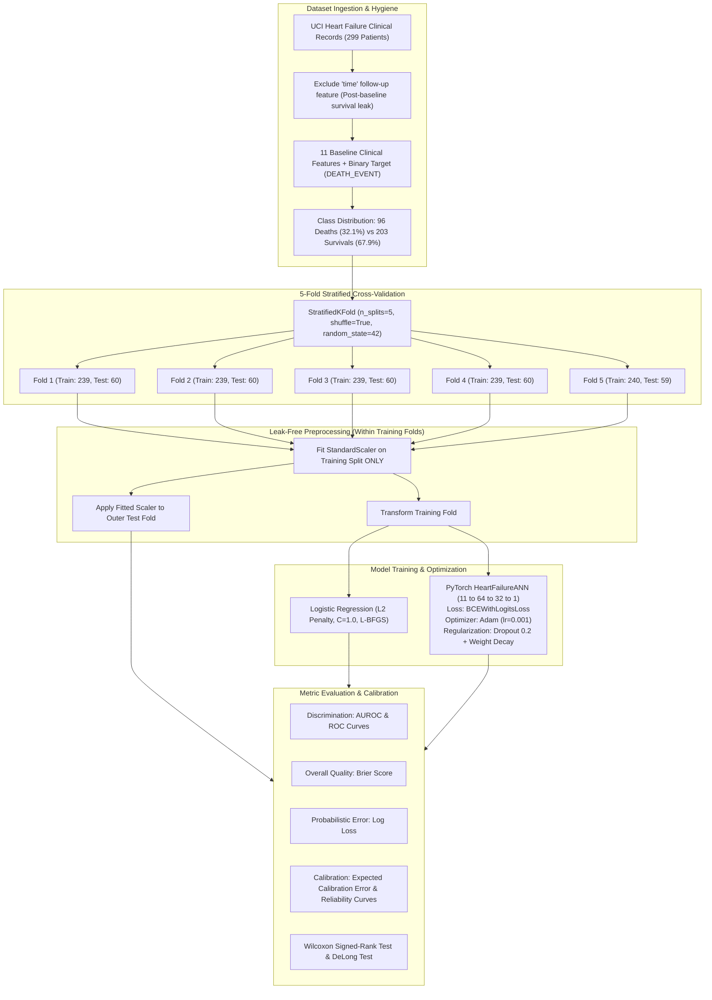

# Machine Learning Training & Validation Pipeline

```mermaid
flowchart TD
    subgraph DataIngestion["Dataset Ingestion & Hygiene"]
        RawData["UCI Heart Failure Clinical Records (299 Patients)"]
        LeakageCheck["Exclude 'time' follow-up feature (Post-baseline survival leak)"]
        Feature11["11 Baseline Clinical Features + Binary Target (DEATH_EVENT)"]
        ImbalanceNotice["Class Distribution: 96 Deaths (32.1%) vs 203 Survivals (67.9%)"]
    end

    subgraph ValidationScheme["5-Fold Stratified Cross-Validation"]
        KFoldSplit["StratifiedKFold (n_splits=5, shuffle=True, random_state=42)"]
        Fold1["Fold 1 (Train: 239, Test: 60)"]
        Fold2["Fold 2 (Train: 239, Test: 60)"]
        Fold3["Fold 3 (Train: 239, Test: 60)"]
        Fold4["Fold 4 (Train: 239, Test: 60)"]
        Fold5["Fold 5 (Train: 240, Test: 59)"]
    end

    subgraph PreprocessingPerFold["Leak-Free Preprocessing (Within Training Folds)"]
        FitScaler["Fit StandardScaler on Training Split ONLY"]
        TransformTrain["Transform Training Fold"]
        TransformTest["Apply Fitted Scaler to Outer Test Fold"]
    end

    subgraph ModelTraining["Model Training & Optimization"]
        LR_Train["Logistic Regression (L2 Penalty, C=1.0, L-BFGS)"]
        ANN_Train["PyTorch HeartFailureANN (11 to 64 to 32 to 1)\nLoss: BCEWithLogitsLoss\nOptimizer: Adam (lr=0.001)\nRegularization: Dropout 0.2 + Weight Decay"]
    end

    subgraph EvaluationMetrics["Metric Evaluation & Calibration"]
        AUROC["Discrimination: AUROC & ROC Curves"]
        Brier["Overall Quality: Brier Score"]
        LogLoss["Probabilistic Error: Log Loss"]
        ECE["Calibration: Expected Calibration Error & Reliability Curves"]
        Significance["Wilcoxon Signed-Rank Test & DeLong Test"]
    end

    RawData --> LeakageCheck --> Feature11 --> ImbalanceNotice --> KFoldSplit
    KFoldSplit --> Fold1 & Fold2 & Fold3 & Fold4 & Fold5
    Fold1 & Fold2 & Fold3 & Fold4 & Fold5 --> FitScaler --> TransformTrain & TransformTest
    TransformTrain --> LR_Train & ANN_Train
    TransformTest --> EvaluationMetrics
    LR_Train --> EvaluationMetrics
    ANN_Train --> EvaluationMetrics
```
