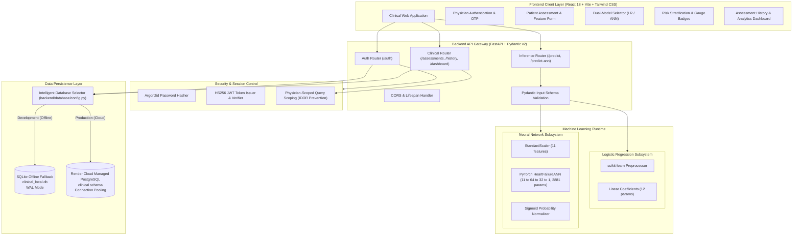

# System Architecture Diagram

```mermaid
flowchart TD
    subgraph ClientLayer["Frontend Client Layer (React 18 + Vite + Tailwind CSS)"]
        UI["Clinical Web Application"]
        AuthView["Physician Authentication & OTP"]
        AssessmentView["Patient Assessment & Feature Form"]
        ModelToggle["Dual-Model Selector (LR / ANN)"]
        RiskViz["Risk Stratification & Gauge Badges"]
        HistoryView["Assessment History & Analytics Dashboard"]
    end

    subgraph APILayer["Backend API Gateway (FastAPI + Pydantic v2)"]
        RouterAuth["Auth Router (/auth)"]
        RouterClin["Clinical Router (/assessments, /history, /dashboard)"]
        RouterPredict["Inference Router (/predict, /predict-ann)"]
        Middleware["CORS & Lifespan Handler"]
        PydanticBoundary["Pydantic Input Schema Validation"]
    end

    subgraph SecurityDomain["Security & Session Control"]
        Argon2id["Argon2id Password Hasher"]
        JWT["HS256 JWT Token Issuer & Verifier"]
        IDOR["Physician-Scoped Query Scoping (IDOR Prevention)"]
    end

    subgraph InferenceEngine["Machine Learning Runtime"]
        subgraph LR_Runtime["Logistic Regression Subsystem"]
            LR_Scaler["scikit-learn Preprocessor"]
            LR_Weights["Linear Coefficients (12 params)"]
        end
        subgraph ANN_Runtime["Neural Network Subsystem"]
            ANN_Scaler["StandardScaler (11 features)"]
            ANN_Net["PyTorch HeartFailureANN (11 to 64 to 32 to 1, 2881 params)"]
            ANN_Sigmoid["Sigmoid Probability Normalizer"]
        end
    end

    subgraph StorageLayer["Data Persistence Layer"]
        DB_Router["Intelligent Database Selector (backend/database/config.py)"]
        LocalSQLite[("SQLite Offline Fallback\nclinical_local.db\nWAL Mode")]
        RenderPG[("Render Cloud Managed PostgreSQL\nclinical schema\nConnection Pooling")]
    end

    %% Interactions
    UI --> RouterAuth
    UI --> RouterClin
    UI --> RouterPredict

    RouterAuth --> SecurityDomain
    RouterClin --> IDOR
    RouterPredict --> PydanticBoundary

    PydanticBoundary --> LR_Runtime
    PydanticBoundary --> ANN_Runtime

    RouterClin --> DB_Router
    RouterAuth --> DB_Router
    DB_Router -->|"Development (Offline)"| LocalSQLite
    DB_Router -->|"Production (Cloud)"| RenderPG
```
